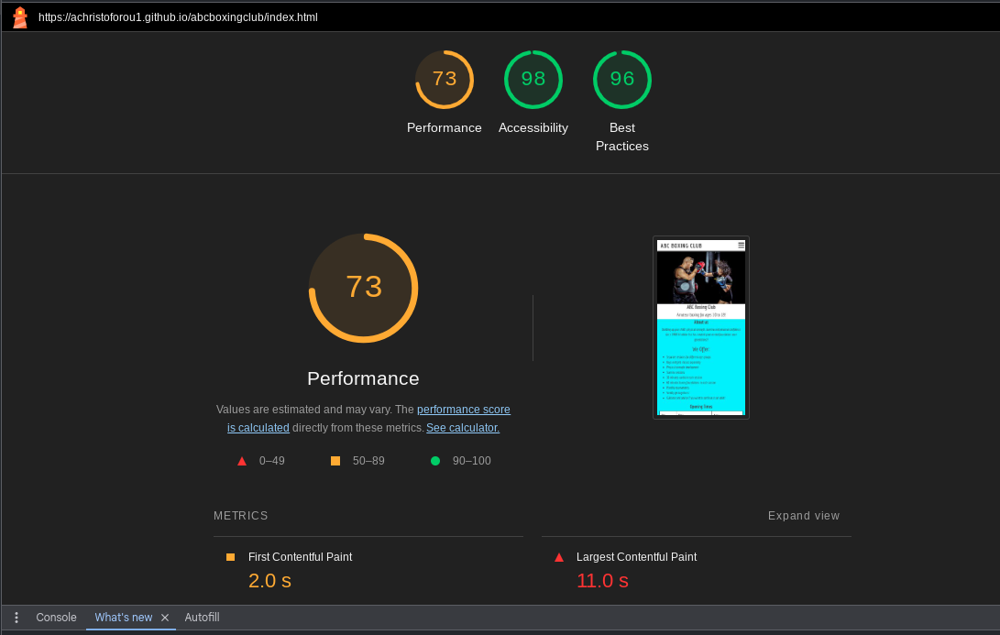

# ABC Boxing Club

The ABC Boxing Club website is a landing page for parents who have children interested in amateur boxing. The ages that are accepted are 10 to 18 years of age.

Users of the website will be able to find all the information they need about the club. What they offer in the facility in full detail, including opening times, pricing, contact information, a full list of what the club offers in these sessions and a sign up form. 

## Features 

### Existing Features

- __Navigation Bar__

  - Featured at the top of the page, the navigation shows the club name in the top left corner:ABC BOXING CLUB that also links back to the top of the page when clicked.
  - The other navigation links are to the right: About us, Sign up, Opening times and Contact us which all link to the different sections of the same page when clicked.
  - The navigation clearly tells the user the name of the club and website and makes the different sections of information easy to find. 

- __The header__

  - The header shows an image of a girl boxing with a trainer who has padding gear on. 
  - The header shows the name of the club in a clear and large font size.
  - The header explains that the boxing club is for children aged 10 to 18.
  - This section provides the user with clear information about what the site is and who the club is for.

- __The About Us Section__

  - The About Us section gives details about what the club offers their members in a list format.
  - This section shows the user the important information they need to know about the club in detail giving the user confidence knowing the club ethos and services provided. 

- __The Opening Times section__

  - This section will allow the user to see exactly when the club sessions start and end on the different days of the week.
  - This section also shows the get together the club has once a week where members and non-members are welcome. 

- __The Sign Up Form__ 

  - The sign up section has a form to collect details from parents so they can sign up to ABC Boxing Club.
  - The form collects the child's name, parent/guardian's name, an email address and a contact phone number.
  - The sign up form is valuable to the user as it gives them the ability to sign up to join the ABC Boxing Club.

- __The Contact Section__

  - The contact section encourages users to get in contact and provides a phone number, email address and street address where they can be found.
  - The contact section includes social media icons so users can find ABC Boxing Club on facebook, twitter and instagram.
  - The contact section is valuable to the user as it gives them the ability to find and contact ABC Boxing Club if they need to.

- __The Sign Up Page__

  - This page will allow the user to get signed up to Love Running to start their running journey with the community. The user will be able specify if they would like to take part in road, trail or both types of running. The user will be asked to submit their full name and email address. 

### Features Left to Implement

- Gallery page/section with images of the facilities and some of training sessions.
- Member and parent/guardian testimonials.

## Testing 

- I tested that this page works in different browsers: Chrome, Safari, Firefox.
- I confirmed that the navigation, header, about us, opening times, sign up and contact text are all readable and easy to understand.
- I confirmed that when clicking on any of the navbar options you are taken to that part of the website page and also the logo on the top left takes the user to the top of the page.
- I have confirmed that the form works: entries in every field, will only accept an email in the email field and a number in the contact number field.

### Bugs

##### Solved bugs

- When I copied and pasted my index.html head onto my success page i'd neglected to copy a closing head tag and also part of the code in the stylesheet link which resulted in my css not being linked to my success page.
- This issue was resolved after checking the code and amending the missing attributes.

### Validator Testing 

- HTML
  - No errors were returned when passing through the official W3C validator

- HTML SUCCESS PAGE
 - No errors were returned when passing through the official W3C validator
 
- CSS
  - No errors were found when passing through the official Jigsaw validator

- Accessibility
   - I confirmed that the colours and fonts are easy to read and accessible by running it through lighthouse in devtools.
   

### Unfixed Bugs

The only issue relating to the low performance report on lighthouse was related to the image of the website.

## Deployment

- The site was deployed to GitHub pages. 

The live link can be found here - https://achristoforou1.github.io/abcboxingclub/

## Credits 

 ### Content 

 - The code to make the social media links was taken from the CI Love Running Project.
- The icons in the footer were taken from [Font Awesome](https://fontawesome.com/)
- The code to make the icons next to the contact us details was taken from the CI Boardwalk Games Project.
- The code for the header was taken in part from the CI Love Running project.
- Favicon was used for the tab icon.
- Bootstrap was used for the table and the form.

### Media

- The image in the header was taken from Pexels.

